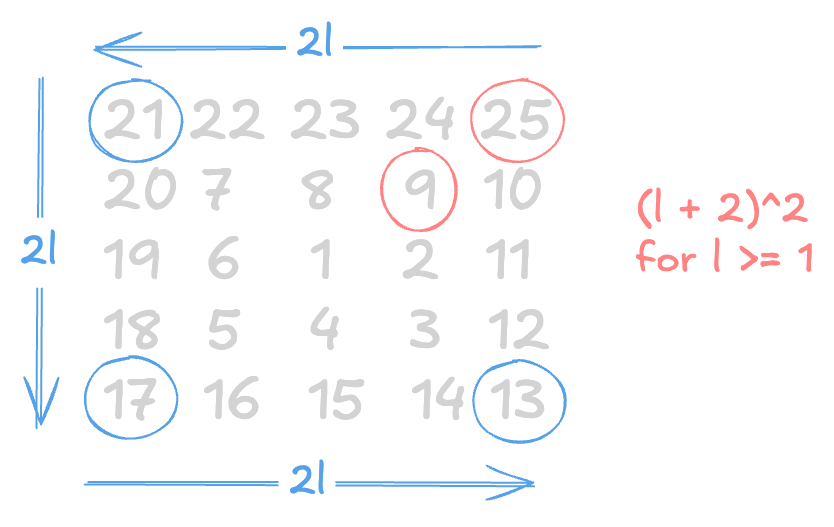

If you break the spiral into concentric "rings" or layers (with $l$ being the layer number), the top-right corner is always the maximum number of that square.

For layer $l$, the side length of the square is $(2l + 1)$.

* $l = 0$: Center number $1$ ($1 \times 1$ square)
* $l = 1$: Outer ring of the $3 \times 3$ square
* $l = 2$: Outer ring of the $5 \times 5$ square

The **top-right corner** is always equal to the total area of the square:

$$\text{Corner}_1 = (2l + 1)^2 = 4l^2 + 4l + 1$$

To get to the other three corners going counter-clockwise around the ring, you just subtract the step size between corners. The step size between corners on layer $l$ is $2l$:

* **Corner 1 (Top-Right):** $4l^2 + 4l + 1$
* **Corner 2 (Top-Left):** $(4l^2 + 4l + 1) - 2l = 4l^2 + 2l + 1$
* **Corner 3 (Bottom-Left):** $(4l^2 + 4l + 1) - 2(2l) = 4l^2 + 1$
* **Corner 4 (Bottom-Right):** $(4l^2 + 4l + 1) - 3(2l) = 4l^2 - 2l + 1$

---

Now, adding all 4 corners of layer $l$ together gives a clean quadratic expression:

$$S_l = (4l^2 + 4l + 1) + (4l^2 + 2l + 1) + (4l^2 + 1) + (4l^2 - 2l + 1)$$

$$S_l = 16l^2 + 4l + 4$$

---

Before doing the large summation, I tested $S_l = 16l^2 + 4l + 4$ on the first couple of layers to make sure my logic held up:

* **For $l = 1$ ($3 \times 3$ spiral):**

$$S_1 = 16(1)^2 + 4(1) + 4 = 24$$

*Actual corners:* $3 + 5 + 7 + 9 = 24$ (Matches!)
* **For $l = 2$ ($5 \times 5$ spiral):**

$$S_2 = 16(2)^2 + 4(2) + 4 = 16(4) + 8 + 4 = 76$$

*Actual corners:* $13 + 17 + 21 + 25 = 76$ (Matches!)

It works!

---

For a $1001 \times 1001$ grid, $2l + 1 = 1001$, which means the outer layer is $l = 500$.

The total diagonal sum is the central number $1$ plus the sum of all corner rings from $l = 1$ to $l = 500$:

$$\text{Total Sum} = 1 + \sum_{l=1}^{500} (16l^2 + 4l + 4)$$

Expanding the summation:

$$\text{Total Sum} = 1 + 16 \sum_{l=1}^{500} l^2 + 4 \sum_{l=1}^{500} l + \sum_{l=1}^{500} 4$$

Using standard summation formulas:

* $\sum_{l=1}^{n} l = \frac{n(n+1)}{2}$
* $\sum_{l=1}^{n} l^2 = \frac{n(n+1)(2n+1)}{6}$

For $n = 500$:

$$\text{Total Sum} = 1 + 16\left(\frac{500 \cdot 501 \cdot 1001}{6}\right) + 4\left(\frac{500 \cdot 501}{2}\right) + 4(500)$$

$$\text{Total Sum} = 1 + 16(41,791,750) + 4(125,250) + 2000$$

$$\text{Total Sum} = 669,171,001$$
